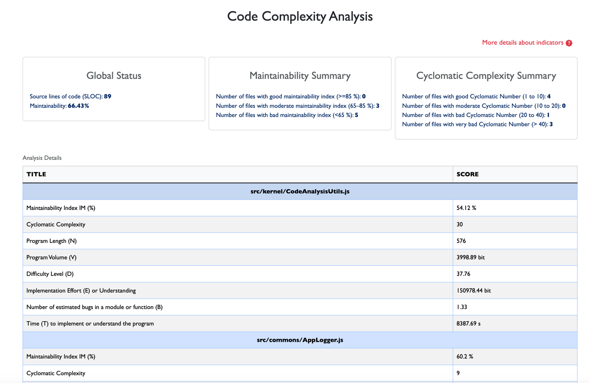
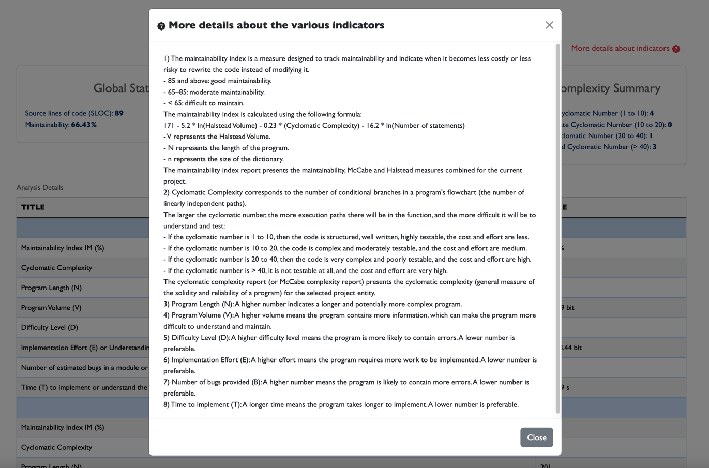

# Code Health Meter

# Table of Contents

1. [Presentation](https://github.com/helabenkhalfallah/CodeHealthMeter/tree/main?tab=readme-ov-file#presentation)
2. [Key Features](https://github.com/helabenkhalfallah/CodeHealthMeter/tree/main?tab=readme-ov-file#key-features)
3. [More Information About Metrics](https://github.com/helabenkhalfallah/CodeHealthMeter/tree/main?tab=readme-ov-file#more-information-about-metrics)
4. [Installation and Usage](https://github.com/helabenkhalfallah/CodeHealthMeter/tree/main?tab=readme-ov-file#installation-and-usage)
5. [Contributing](https://github.com/helabenkhalfallah/CodeHealthMeter/tree/main?tab=readme-ov-file#contributing)
6. [License](https://github.com/helabenkhalfallah/CodeHealthMeter/tree/main?tab=readme-ov-file#license)

## Presentation

**CodeHealthMeter** is a comprehensive tool designed to measure and monitor the health of a codebase. It provides a **quantitative evaluation (computational complexity)** of your code's maintainability, complexity, and size using a variety of established software metrics.

Quantitative software quality analysis involves a mathematical approach to analyzing the source code and architecture of a software system. By applying formulas like the Halstead metrics and the Maintainability Index, we can obtain precise, objective measures of various aspects of the software’s quality:

```js
// SLOC: This is a simple metric that counts the number of lines in the source code.

// Cyclomatic Complexity (M) = E − N + 2P
// where E is the number of edges in the flow graph, N is the number of nodes, and P is the number of connected components.

// Halstead Metrics:
// - The number of operators (`n1`) and operands (`n2`) in the program's source code
// - Program length (`N`): `N = n1 + n2`
// - Program vocabulary (`n`): `n = N1 + N2`
// - Volume (`V`): `V = N * log2(n)`
// - Difficulty (`D`): `D = (n1/2) * (N2/n2)`
// - Effort (`E`): `E = D * V`
// Maintainability Index (MI) = 171 - 5.2 * ln(V) - 0.23 * v(g) - 16.2 * ln(SLOC)
```

These metrics, among others, allow us to quantify attributes of the software that might otherwise be difficult to measure. This quantitative approach provides a more precise and objective assessment of software quality compared to more subjective methods.

Subjective methods for evaluating software quality often involve human judgment and interpretation. Here are a few examples:
- **Peer Review**: This involves having one or more colleagues review your code. They can provide feedback on various aspects such as coding style, logic, and potential bugs. However, the feedback can vary greatly depending on the reviewer’s experience, knowledge, and personal preferences.
- **User Feedback**: Collecting feedback from users is another subjective method. Users can provide valuable insights into the usability and functionality of the software. However, user feedback can be highly subjective and may not always reflect the technical quality of the software.
- **Heuristic Evaluation**: This involves having a small set of evaluators examine the user interface against a list of heuristic principles (e.g., Nielsen’s Heuristics). It’s subjective as it heavily relies on the expertise of the evaluators.
- **Expert Opinion**: An expert in the field provides their assessment of the software quality. This can be beneficial due to the expert’s deep knowledge, but again, it’s subjective and can be influenced by personal bias.

While these methods can provide valuable insights, they lack the objectivity and precision of quantitative methods like Halstead metrics or cyclomatic complexity. Therefore, a combination of both subjective and objective methods is often used in practice for a comprehensive evaluation of software quality.

---

## Key Features

- **Maintainability Index**: This metric provides a single score that reflects the maintainability of your code. It takes into account factors such as cyclomatic complexity, Halstead volume, and lines of code.

- **Cyclomatic Complexity**: This metric measures the number of linearly independent paths through a program's source code. It is a quantitative measure of the number of logical decisions a program can make, providing insights into its complexity.

- **Halstead Metrics**: Developed by Maurice Howard Halstead, these metrics provide insights into the complexity and understandability of your code. They measure aspects such as the number of unique operators and operands, program length, and program volume.

- **Source Lines of Code (SLOC)**: SLOC is a simple yet effective metric for estimating the size of a software program. It counts the number of lines in the source code, providing a measure of the program's length.

- **Report Generation**: CodeHealthMeter generates detailed reports in both HTML and JSON formats. These reports provide a visual and structured view of the metrics, making it easy to understand the health of your codebase at a glance.

By leveraging these metrics, CodeHealthMeter allows you to gain a deeper understanding of your code's health. 
It helps you identify potential areas for improvement, making it an invaluable tool for maintaining high-quality, efficient, and maintainable code.

---

## More information about metrics

- **Cyclomatic Complexity**: 
Cyclomatic complexity is a software metric used to indicate the complexity of a program. 
It is a quantitative measure of the number of linearly independent paths through a program’s source code. You can read more about it on [Wikipedia](https://en.wikipedia.org/wiki/Cyclomatic_complexity).

- **Halstead Complexity**:
Halstead complexity measures are software metrics introduced by Maurice Howard Halstead in 1977 as part of his treatise on establishing an empirical science of software development. 
Halstead made the observation that metrics of the software should reflect the implementation or expression of algorithms in different languages, but be independent of their execution on a specific platform. 
You can read more about it on [Wikipedia](https://en.wikipedia.org/wiki/Halstead_complexity_measures).

- **Maintainability Index**: 
Maintainability Index is a software metric which measures how maintainable (easy to support and change) the source code is. 
The maintainability index is calculated as a factored formula consisting of SLOC (Source Lines Of Code), Cyclomatic Complexity and Halstead volume. 
It was originally developed by Oman & Hagemeister in the early 1990s. You can read more about it on [Wikipedia](https://learn.microsoft.com/en-us/visualstudio/code-quality/code-metrics-maintainability-index-range-and-meaning?view=vs-2022).

---

## Installation and usage

1. Install the dependencies:
    ```
    npm install
    ```

2. Run the analysis on your project:
    ```
    npm run code-health-meter --srcDir "../../my-path" --outputDir "../../my-output-path" --outputFile "OutputFileName" --format "json or html"
    ```

Or using `npx`:
   ```
   npx code-health-meter --srcDir "../../my-path" --outputDir "../../my-output-path" --outputFile "OutputFileName" --format "json or html"
   ```

Example of a JSON report:
```
{
  "summary": {
    "total": {
      "sloc": 5324180,
      "maintainability": 3650140.4030000097
    },
    "average": {
      "sloc": 107,
      "maintainability": "73.54"
    }
  },
  "reports": {
    "src/XX/FileName.ts": [
      {
        "title": "Maintainability Index IM (%)",
        "score": "49.12 %"
      },
      {
        "title": "Cyclomatic Complexity",
        "score": "11 "
      },
      {
        "title": "Program Length (N)",
        "score": "483 "
      },
      {
        "title": "Program Volume (V)",
        "score": "3236.31 bit"
      },
      {
        "title": "Difficulty Level (D)",
        "score": "26.91 "
      },
      {
        "title": "Implementation Effort (E) or Understanding",
        "score": "87086.22 bit"
      },
      {
        "title": "Number of estimated bugs in a module or function (B)",
        "score": "1.08 "
      },
      {
        "title": "Time (T) to implement or understand the program",
        "score": "4838.12 s"
      }
    ],
    "FileName.ts": [
      {
        "title": "Maintainability Index IM (%)",
        "score": "49.65 %"
      },
      {
        "title": "Cyclomatic Complexity",
        "score": "20 "
      },
      {
        "title": "Program Length (N)",
        "score": "540 "
      },
      {
        "title": "Program Volume (V)",
        "score": "3633.08 bit"
      },
      {
        "title": "Difficulty Level (D)",
        "score": "34.09 "
      },
      {
        "title": "Implementation Effort (E) or Understanding",
        "score": "123866.56 bit"
      },
      {
        "title": "Number of estimated bugs in a module or function (B)",
        "score": "1.21 "
      },
      {
        "title": "Time (T) to implement or understand the program",
        "score": "6881.48 s"
      }
    ],
    ...   
```

Example of an HTML report:




---

## Contributing

Contributions are welcome! Please read the contributing guidelines before getting started.

1. Clone the repository:
    ```
    git clone https://github.com/helabenkhalfallah/CodeHealthMeter.git
    cd CodeHealthMeter
    ```

2. Install the dependencies:
    ```
    npm install
    ```

3. To locally test the analysis you can run:
    ```
    npm run scan --srcDir "../../my-path" --outputDir "../../my-output-path" --outputFile "OutputFileName" --format "json or html"
    ```
    ```
    npx scan --srcDir "../../my-path" --outputDir "../../my-output-path" --outputFile "OutputFileName" --format "json or html"
    ```

---

## License

This project is licensed under the terms of the MIT license. See the LICENSE file for details.
